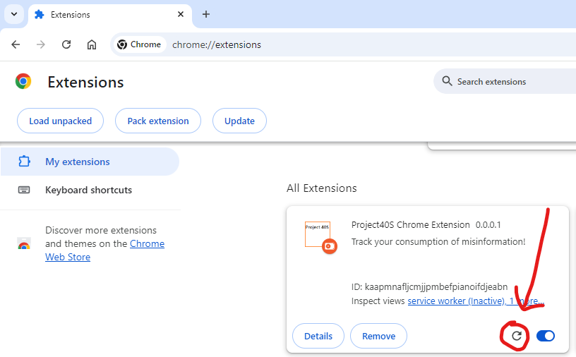

## Prerequisites

* [node + npm](https://nodejs.org/) (Current Version)

## Project Structure

* src: typescript files - the initial files the extension loads.
    * src/pages: tsx files (pages).
    * src/components: tsx files (components).
* dist: the output of the build (i.e. npm run ___). No need to change these files.
* docs: images used for this readme

## Setup

[in the folder you wish the 'project40s' folder to be placed]
```
git clone https://github.com/PoseidonOcto/project40s.git
cd project40s
npm install
```

Load the extension in chrome - in the chrome extensions page, load `dist` directory.
> (see https://betterprogramming.pub/creating-chrome-extensions-with-typescript-914873467b65#:~:text=5.%20Load%20the%20extension)

## Build (Development)

```
npm run watch
```
Run this once, leave the window open, and every time you make a change it will automatically rebuild.

After certain changes, you will need to reload the extension.
> 

| Extension component           | Requires extension reload |
| ----------------------------- | ------------------------- |
| The manifest                  | Yes                       |
| Service worker                | Yes                       |
| Content scripts               | Yes (plus the host page)  |
| The popup                     | No                        |
| Options page                  | No                        |
| Other extension HTML pages    | No                        |

> Source: https://developer.chrome.com/docs/extensions/get-started/tutorial/hello-world

NOTE: For the options page, you will still need to refresh the page.


## Build (Production)
You don't have any need for this command.
```
npm run build
```

## Other References
Used the template 'https://github.com/chibat/chrome-extension-typescript-starter' (many thanks).
